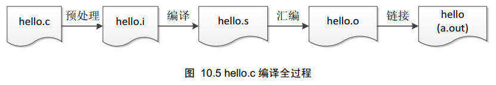

# 编译过程与GCC命令

## 名词解析

GCC（the GNU Compiler Collection），是GNU的编译套件，可以理解成是一种编译器。

[GNU](https://en.wikipedia.org/wiki/GNU)（GNU‘s Not Unix）：**划重点：**不是重点，一个组织，推广开源，有一个开源内核项目（是Unix-Like的）,是Linux的基础。

编译器：用于编译代码，把代码变成可执行程序（可自主了解：编译与解释的区别）。

## 编译命令与简单参数

最简单的编译指令（从头做到尾）：

```
gcc hello.c
# 将会把hello.c 编译成a.out
```

指定输出文件：`-o`

```
gcc hello.c -o hello
```

指定优化等级（[O0到O3](https://blog.csdn.net/zhangzq86/article/details/80840927)，提升效率用）：

```
gcc hello.c -O2 -o hello
```

提供警告(debug用)：

```
gcc hello.c -O2 -o hello -Wall -Wextra -Wconversion
```

保留额外信息供gdb使用（debug用）：

```
gcc hello.c -O2 -o hello -Wall -Wextra -Wconversion -g
```

将警告视作错误（高标准严要求用，**慎用**）：

```
gcc hello.c -O2 -o hello -Wall -Wextra -Wconversion -g -Werror
```

简单的编译命令，足以：

```
gcc hello.c -o hello
```

## 编译过程

我们需要了解编译器大概在编译过程中做了什么事情，以下是将hello.c变成可执行性程序的全过程：



（不关键）预处理：宏展开，（拓展阅读：[[什么是宏？](https://zhuanlan.zhihu.com/p/26978356)]）

编译：将高级语言变成低级语言（汇编语言），详询**编译原理**这门课。

汇编：将汇编语言变成可重定向文件（什么是可重定向文件？为什么要有这种文件？详询本门课的**链接**部分）

链接：将一个或多个可重定向文件链接成一个可执行文件

gcc提供了生成中间过程的命令：

（不关键）生成 `hello.i`： -E

（将在炸弹lab用到）生成 `hello.s`：-S

（将在链接lab用到）生成 `hello.o`： -c

